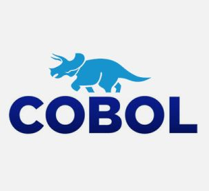

<h1 align="center"> Hi, I'm Augusto</h1>

  <samp>
Welcome to my profile! 
 
I am a university student pursuing a Bachelor's degree in Systems Engineering. I consider myself proactive, creative, and efficient when it comes to problem-solving. I have practical experience in programming, web development, and database management, and I possess skills in several programming languages. Some of the technologies I am proficient in include Java, Spring Boot, Go, Angular, React, PL/SQL, Git, and Jira. I enjoy working collaboratively in teams, contributing to innovative solutions, and respecting different perspectives. My aim is to continue my professional growth, expand my knowledge, and bring value to the company I work for while fostering successful and collaborative working relationships.
  </samp>  
  
  
  <h2 align="center">Technologies</h2>

    &nbsp; &nbsp;
    &nbsp; &nbsp;
    &nbsp; &nbsp;
    &nbsp; &nbsp;
    &nbsp; &nbsp;
    &nbsp; &nbsp;
    &nbsp; &nbsp;
    &nbsp; &nbsp;
  

 

<h2 align="center"> Contact me 📫 </h2>

  &nbsp; &nbsp; &nbsp; 
  &nbsp;&nbsp;&nbsp;&nbsp;

